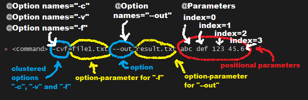

# ZIT development log

## Summary

原作者地址: [https://www.leshenko.net/p/ugit](https://www.leshenko.net/p/ugit)

对 `git` 挺感兴趣，就照着实现了一个java版本的，多谢作者大佬写出这样的文章系列能让小弟我也体验一把。

## TODO

1. git hash-object todo. When real Git stores objects it does a few extra things, such as writing the size of the object to the file as well, compressing them and dividing the objects into 256 directories. This is done to avoid having directories with huge number of files, which can hurt performance.


## Notes

1. 这个暂时记录下，没查明白：打包用 shade, 要不然要和 classpath相关联导致idea运行没啥问题，打包后却各种问题

2. 命令行解析用了 `picocli` 这个库，可参考 `git init`, `git hash-object` 了解基本使用，很容易上手且巨好用，简答说命令行的参数就两种，`options` 和 `positional parameters`，参考下图



3. 工具库用了 `guava`, 里面的方法都是 `@Beta`, 所以后续看看是不是要提取下或者用 `zerobox` 作为依赖

4. `write-tree` 几个注意点

   - 对象分两种，一个 是 `tree` 代表目录且仅返回一级目录的情况, 一个是 `blob` 即文件
   - 在递归过程中不要忘记了路径的变换要带上前置路径来确保总是使用同一个位置的相对路径
   - `File` 类为空文件夹 `listPath` 会返回长度为 0 的数组，只有当不是文件夹时该函数才返回 `null`
   - `listFiles` 获取的 `File` 列表中的 `file` 调用 `getPath` 返回的路径是拼接前置路径的，但是会因为环境的不同，路径的分隔符就会不同，这点需要考虑到 `ignore` 函数上
   
5. `os.walk` 的返回值是一个生成器(generator),也就是说我们需要不断的遍历它，来获得所有的内容。而每次遍历的对象都是返回的是一个三元组(root,dirs,files)
   
   - `root` 所指的是当前正在遍历的这个文件夹的本身的地址
   - `dirs` 是一个 list ，内容是该文件夹中所有的目录的名字(不包括子目录)
   - `files` 同样是 list , 内容是该文件夹中所有的文件(不包括子目录)
   - Java nio 包的 `Files` class 也同样提供了类似的功能, `walk` 获取的目录是以传入 PATH 开头的相对目录
   - 配合 walk 可用的 `relative, resolve, System.lineSeparator` 等   

6. diff 算法没搞明白（-_- 菜的浑身发抖），暂时收集到这些资料，找了网上的一个实现，后续有时间理解下这里然后再决定重写一版
   - `doc` 文件夹下的工具和 paper
   - blog 
      - https://blog.jcoglan.com/2017/02/12/the-myers-diff-algorithm-part-1/
      - https://blog.robertelder.org/diff-algorithm/
      - http://simplygenius.net/Article/DiffTutorial1
      - https://chenshinan.github.io/2019/05/02/git%E7%94%9F%E6%88%90diff%E5%8E%9F%E7%90%86%EF%BC%9AMyers%E5%B7%AE%E5%88%86%E7%AE%97%E6%B3%95/
   - 概念普及
      - d: 代表步数即最小操作数，我们的第一个大目的就是找出这个最小的数
      - 操作：d 每加 1 意味进行了一次 x + 1 + diagonal 或者 y + 1 + diagonal. 其中 diagonal 为遇到斜线的数量
      - x， y: 分别指 A B 两个串的行数，x 增加时意味着从 A 串删除， y 增加时意味着从 B 串增加， x,y 同时增加意味着遇到斜线了
      - k: x - y 的值
      - d 和 xyk 的关系：
        - d 代表步数，可以到达点 (i，j), 如果期间经过了对角线， i, j 必定同时加 1
        - 由上可得 d 可到达的步数为 (i + diagonal, j + diagonal), 其中diagonal 为经过对角线的次数
        - 那么k = x - y = i - j  的奇偶性就依赖于 d
        - 当 d 为奇数， i + j 就是奇数，自然 i-j 就是奇数 => d 奇 k 奇, d 偶 k 偶
        - k 这里有个重点意识：任何抵达 k 线的点 必经过了至少 |k| 个 增或者删操作
        - 最终为了走到格子右下角，那么其实最终的 x, y，k 都已经确定了，只不过要确定的是 d 而已
        - d 之所以可以作为第一层循环是因为 d = f(d - 1), 即 d - 1 是 d 的子问题
        - d 确定为最外层循环后，k 的范围可以根据 d 来确认，至此，最内层要做的就是找到能抵达的最远的距离，最远距离超过右下角时目标达成，此时的 d 就是最小 d
        - 上述推论下问题只剩一个了，如何找到最远的距离？（思考这个问题时先假设没有斜线这个概念，只有纯粹得下或者右，这样可能有助于理解）
            - k是以2来迭代的， 每次 `v[k] = v[k-1]` 或者 v[k + 1], 这里由于每次d的奇偶性限定了 k 的奇偶性，其实这里的 `v[k-1] v[k+1]` 取得上轮外层 d 循环得值
            - 换句话说 当前轮得 `V[k]` 是指 `V[k+-1]` 走了一步后得结果，而`v[k-1]` 到 `v[k]` 一定是 v 往右走了至少一步（超过一步得都是斜线）, 所以 `x = v[k-1] + 1`, 而 `v[k+1]` 则是往下走了一步，这时 `x` 不变
            - `k == -d`, 此时只能从 `k+1` 往下走( `k -1` 此时还没有值，并且越界，`k+1` 往右走就到 `k+2` 了，所以走了一步后 x = v[k+1] ) 同理， `k = d` 自然 `k - 1` 往右走, 此时 `x+1`
            - 其他情况自然取 `v[k -1]`  `v[k + 1]` 比较大得那个值
            ```python
            if k == -D or k != D and V[k - 1] < V[k + 1]:
                   x = V[k + 1]
            else:
                   x = V[k - 1] + 1
            ```
## Usage

0. `alias zit='java -jar ../zit-1.0-SNAPSHOT-shaded.jar'` alias the zit executable file.
   
   - windows could set here `C:\Program Files\Git\etc\profile.d\aliases.sh`

1. `zit init` init directory `.zit` which include `objects` subdirectory and set `main` branch as default to prevent detached head

2. `zit hash-object file` 
   
   - Get the path of the file to store.
   - Read the file.
   - Hash the *content* of the file using SHA-1.
   - Store the file under ".ugit/objects/{the SHA-1 hash}".
   
3. `zit cat-file hash [object|tree|commit|...type]` print the file content

4. `zit write-tree` generate the tree which is the whole description of the repository

5. `zit read-tree hash` 
   
   - pay attention！this action will delete all existing stuff before reading.
   - So you can use `cat-file` to find which tree is the `root`, and the logs of `write-tree` also help you find all the trees.  

6. Although `write-tree` can save version, but it does not take any context information, so will need to develop `zit commit -m "message"` command. 
   
   - you can use `cat-file hash commit` to check your commit content
   - `HEAD` will record your commit with its parent.
   
7. Just enjoy commit and the type `log` to see the logs.

8. Now we get the first point: `checkout`. Pick a commit id from the `log` and checkout whether things as expected.

   - [fixed with getBytes(Charsets.UTF-8)] find bug todo: chinese file or dir name got messy code
   
9. `tag` will alias commit id, and at this time, you will get first inner core concept.
   
   - [git-ref](https://git-scm.com/book/en/v2/Git-Internals-Git-References)

10. todo: `zit lg` graph feature with Graphviz

11. `zit branch name [id]` so familiar.
   
   - every ref under refs/heads as a branch.
     
12. `zit show` will use diff show changes detail while status only show simply changes info.

